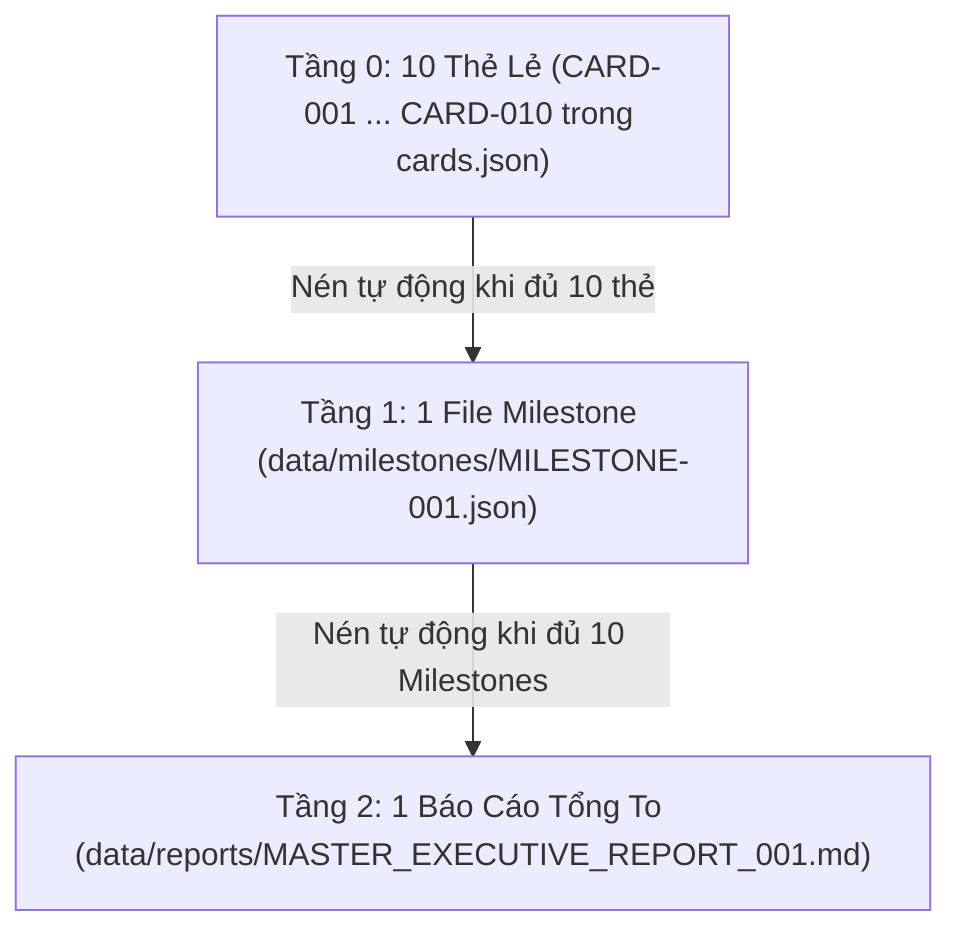

# AUTO IDEA TO PRODUCT (PROACTIVE CARD & GRAPH VISUALIZER ENGINE)

> **Mục tiêu**: Hệ thống Skill tự động hóa 100%. Áp dụng Quy chế Nén Thẻ Phân Cấp (10-in-1 Compaction) và Tự động vẽ Đồ thị Kiến trúc Cấu trúc Dự án trên file `docs/architecture.html` (để tránh làm hỏng file `index.html` của ứng dụng React/Vite).

## 🎨 TỰ ĐỘNG VẼ ĐỒ THỊ CẤU TRÚC DỰ ÁN (`docs/architecture.html`)

Hệ thống luôn tự động tạo và cập nhật file **`docs/architecture.html`** để trực quan hóa:
1. **Sơ đồ Kiến trúc C4 Model**: Thể hiện các luồng tương tác giữa Prompt -> Card Manager -> Compaction Engine -> Subagents -> Execution.
2. **Sơ đồ Luồng Nén Thẻ Phân Cấp (Hierarchical Compaction Flowchart)**: Trực quan hóa tiến trình nén 10 Thẻ Lẻ -> 1 File Milestone (`data/milestones/`) -> 1 Báo Cáo Tổng To (`data/reports/`).
3. **Bảng Theo Dõi Trạng Thái Thẻ Thời Gian Thực**: Mermaid.js & HTML Table cập nhật tiến độ công việc minh bạch.

---

## 🗂 QUY CHẾ NÉN THẺ PHÂN CẤP (HIERARCHICAL CARD COMPACTION)

1. **Tầng 0: Thẻ Lẻ (`cards.json`)**: Chỉ giữ lại tối đa < 10 thẻ active.
2. **Tầng 1: File Milestone (`data/milestones/MILESTONE-xxx.json`)**: 10 Thẻ Lẻ -> 1 File Milestone.
3. **Tầng 2: Báo Cáo Tổng To (`data/reports/MASTER_EXECUTIVE_REPORT_xxx.md`)**: 10 File Milestone (100 Thẻ) -> 1 Trang Báo Cáo Tổng To.
