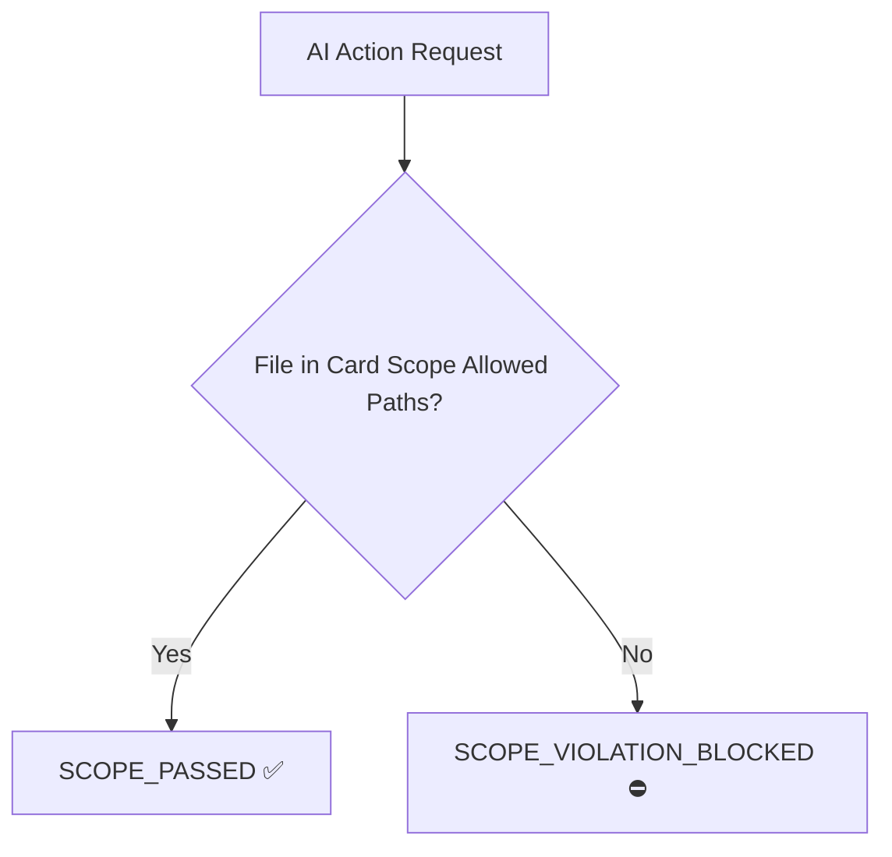

# ADR-002: Implementation of Scope Enforcer Boundary Guard

- **Status:** APPROVED
- **Date:** 2026-07-27
- **Deciders:** Principal Solution Architect & User

---

## CONTEXT
Unrestricted AI Subagent execution often leads to context drift, unwanted modifications across unrelated source files, and excessive prompt token consumption.

## DECISION
We implemented a strict Scope Boundary Guard (`scripts/scope-enforcer.js`). Every card created is assigned an explicit scope (e.g. `SCOPE_DIAGRAM`, `SCOPE_CORE_ENGINE`, `SCOPE_SECURITY`, `SCOPE_PAYMENT`). File modifications outside the allowed scope paths are blocked automatically.

## PROS
1. **Token Cost Control**: Prevents subagents from inspecting or modifying unrelated files.
2. **Codebase Protection**: Eliminates side-effects and accidental regressions.
3. **Structured Milestones**: Groups cards cleanly by scope when compacting into milestone files.

## CONS
1. Multi-scope cross-cutting refactoring tasks require explicit `GLOBAL_SCOPE` assignment.
