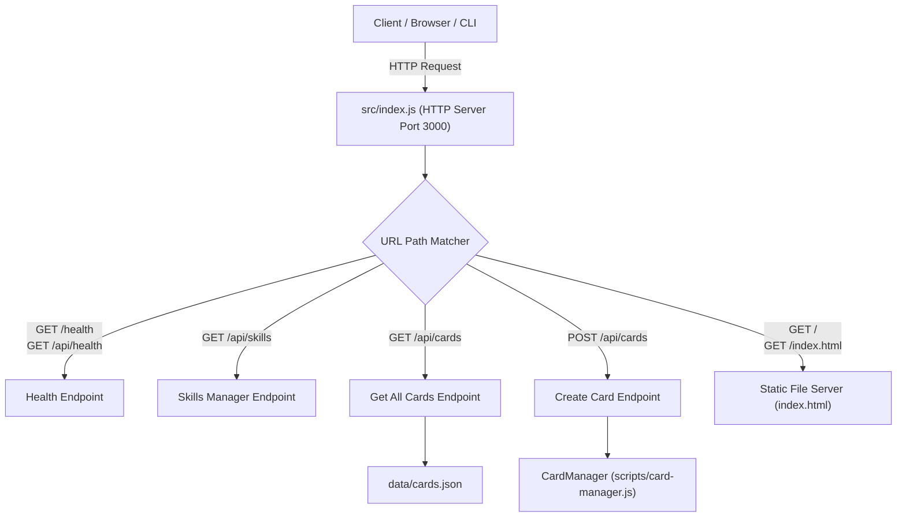

# 8. API Architecture Documentation

---

## 🌐 8.1 API Overview & Server Implementation

The API Server is implemented in `src/index.js` using Node.js native `http` module listening on port `3000` (configurable via `process.env.PORT`).



---

## 📝 8.2 Endpoint Specifications

### 1. `GET /api/health`
- **Description**: Verifies API Server uptime and operational health.
- **Response**: `200 OK`
  ```json
  {
    "status": "UP",
    "app": "Universal Community Auto-Idea Skill Engine",
    "timestamp": "2026-07-27T19:50:00.000Z"
  }
  ```

### 2. `GET /api/cards`
- **Description**: Returns all active task cards from `data/cards.json`.
- **Response**: `200 OK`
  ```json
  {
    "status": "SUCCESS",
    "totalCards": 2,
    "cards": [ /* Card Objects Array */ ]
  }
  ```

### 3. `POST /api/cards`
- **Description**: Creates a new task card from a user prompt, detects its Scope, and triggers auto-compaction if needed.
- **Request Payload**:
  ```json
  {
    "prompt": "Tích hợp mã ngân hàng ting-ting",
    "category": "Payment"
  }
  ```
- **Response**: `201 Created`
  ```json
  {
    "status": "SUCCESS",
    "card": {
      "id": "CARD-002",
      "prompt": "Tích hợp mã ngân hàng ting-ting",
      "scope": "SCOPE_PAYMENT",
      "status": "IN_PROGRESS"
    }
  }
  ```
