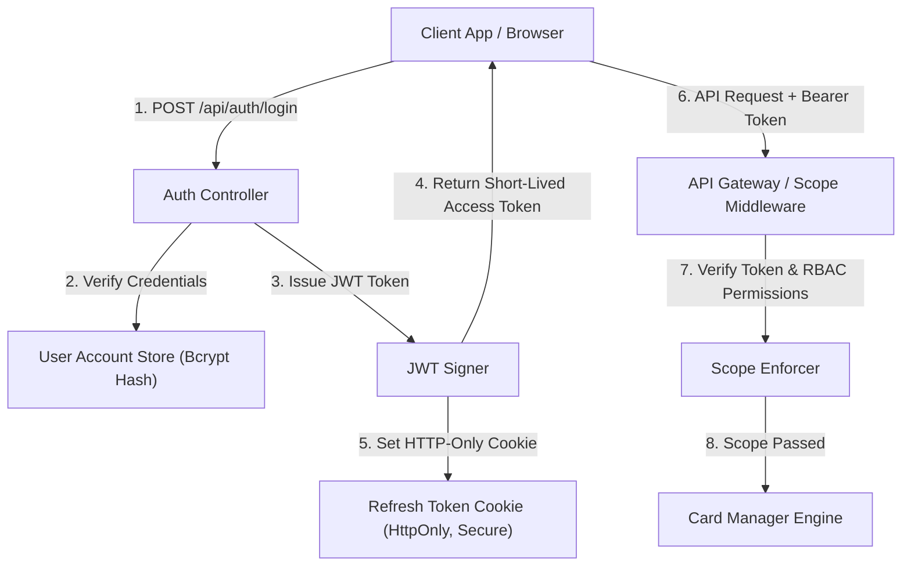

# 11. Authentication & Security Flow Documentation

**Status in Current Source Code:** Local & CLI Direct Execution Mode (Authentication Middleware is *Not Implemented* for local CLI mode, but proposed below for Production Deployment).

---

## 🔒 11.1 Proposed Enterprise Security & Auth Architecture

---

## 🛡 11.2 Scope & Permission RBAC Table (Proposed Blueprint)

| Role | Permitted Scopes | Allowed Operations |
| :--- | :--- | :--- |
| **USER / DEVELOPER** | `SCOPE_DIAGRAM`, `SCOPE_PAYMENT`, `SCOPE_CORE_ENGINE` | Tạo thẻ mới, đọc thẻ active, xem sơ đồ `index.html`. |
| **ADMIN / ARCHITECT** | `GLOBAL_SCOPE` | Nén thẻ thủ công, dọn dẹp Milestones, sửa file hệ thống core. |
| **GUEST** | `SCOPE_READONLY` | Chỉ được phép xem `index.html` và `GET /api/cards`. |
