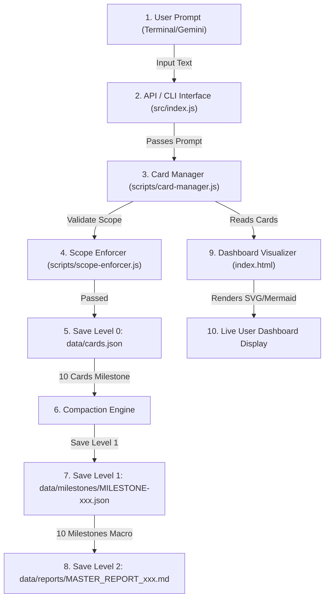

# 10. Data Flow Diagram Documentation

---

## 🌊 10.1 End-to-End Data Flow Pipeline

```mermaid
graph TD
    UserPrompt["1. User Prompt (Terminal/Gemini)"] -->|Input Text| API["2. API / CLI Interface (src/index.js)"]
    API -->|Passes Prompt| Manager["3. Card Manager (scripts/card-manager.js)"]
    
    Manager -->|Validate Scope| ScopeGuard["4. Scope Enforcer (scripts/scope-enforcer.js)"]
    ScopeGuard -->|Passed| SaveLevel0["5. Save Level 0: data/cards.json"]
    
    SaveLevel0 -->|10 Cards Milestone| Compactor["6. Compaction Engine"]
    Compactor -->|Save Level 1| Milestones["7. Save Level 1: data/milestones/MILESTONE-xxx.json"]
    Milestones -->|10 Milestones Macro| Reports["8. Save Level 2: data/reports/MASTER_REPORT_xxx.md"]

    Manager -->|Reads Cards| Visualizer["9. Dashboard Visualizer (index.html)"]
    Visualizer -->|Renders SVG/Mermaid| UserView["10. Live User Dashboard Display"]
```
