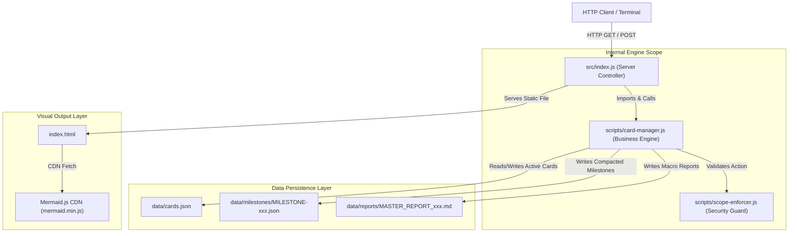

# 6. Dependency Diagram Documentation

---

## 🔗 6.1 Complete Call Chain & Dependency Flow

---

## 🔍 6.2 Full Dependency Matrix

1. `src/index.js` ➔ `scripts/card-manager.js` (Required)
2. `scripts/card-manager.js` ➔ `scripts/scope-enforcer.js` (Required)
3. `scripts/card-manager.js` ➔ `data/cards.json` (Required, Auto-creates if missing)
4. `scripts/card-manager.js` ➔ `data/milestones/` (Required, Auto-creates if missing)
5. `scripts/card-manager.js` ➔ `data/reports/` (Required, Auto-creates if missing)
6. `index.html` ➔ `https://cdn.jsdelivr.net/npm/mermaid@10/dist/mermaid.min.js` (External CDN for rendering graphs)
