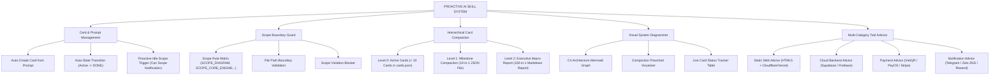

# 5. Feature Tree Documentation

---

## 🌲 5.1 System Feature Tree Diagram

```mermaid
graph TD
    Root["PROACTIVE AI SKILL SYSTEM"] --> F1["Card & Prompt Management"]
    Root --> F2["Scope Boundary Guard"]
    Root --> F3["Hierarchical Card Compaction"]
    Root --> F4["Visual System Diagrammer"]
    Root --> F5["Multi-Category Tool Advisor"]

    F1 --> F1_1["Auto-Create Card from Prompt"]
    F1 --> F1_2["Auto-State Transition (Active -> DONE)"]
    F1 --> F1_3["Proactive Idle Scope Trigger (Cạn Scope Notification)"]

    F2 --> F2_1["Scope Rule Matrix (SCOPE_DIAGRAM, SCOPE_CORE_ENGINE...)"]
    F2 --> F2_2["File Path Boundary Validation"]
    F2 --> F2_3["Scope Violation Blocker"]

    F3 --> F3_1["Level 0: Active Cards (< 10 Cards in cards.json)"]
    F3 --> F3_2["Level 1: Milestone Compaction (10-in-1 JSON File)"]
    F3 --> F3_3["Level 2: Executive Macro Report (100-in-1 Markdown Report)"]

    F4 --> F4_1["C4 Architecture Mermaid Graph"]
    F4 --> F4_2["Compaction Flowchart Visualizer"]
    F4 --> F4_3["Live Card Status Tracker Table"]

    F5 --> F5_1["Static Web Advice (HTML5 + Cloudflare/Vercel)"]
    F5 --> F5_2["Cloud Backend Advice (Supabase / Firebase)"]
    F5 --> F5_3["Payment Advice (VietQR / PayOS / Stripe)"]
    F5 --> F5_4["Notification Advice (Telegram / Zalo ZNS / Resend)"]
```
