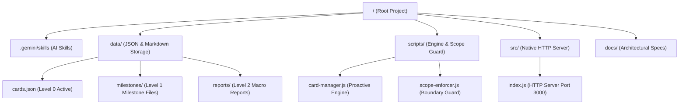
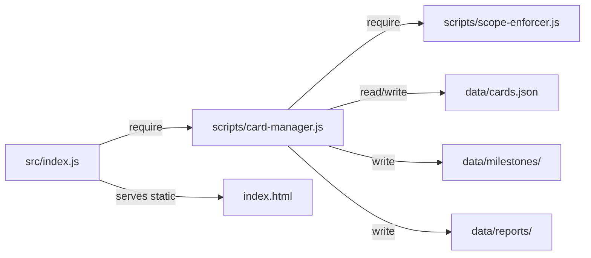

# 1. Folder Structure Documentation

**Project Name:** Universal Proactive AI Skill System & Card Compaction Architecture  
**Generated At:** 2026-07-27  

---

## 🌳 1.1 Tree Structure (Source Code Fact)

```text
/Volumes/sdd anh/skill/
├── README.md                            # Open-source community installation & usage guide
├── package.json                         # Node.js manifest & npm scripts
├── index.html                           # Live Mermaid.js visual architecture dashboard
│
├── .gemini/
│   └── skills/                          # Custom AI Skill Definitions
│       ├── auto-idea-to-product/
│       │   └── SKILL.md                 # Proactive Card Engine & Compaction Skill
│       └── system-architecture-diagrammer/
│           └── SKILL.md                 # Visual System Diagrammer Skill
│
├── data/                                # Persistent Data Storage Layer
│   ├── cards.json                       # Level 0: Active task cards array (Max < 10)
│   ├── milestones/                      # Level 1: Compacted 10-in-1 milestone JSON files
│   └── reports/                         # Level 2: Compacted 100-in-1 executive markdown reports
│
├── scripts/                             # Core Business Engine Scripts
│   ├── card-manager.js                  # Proactive Card Engine & 10-to-1 Compaction logic
│   └── scope-enforcer.js                # Strict Scope Boundary Enforcer Guard
│
├── src/                                 # Runtime HTTP API Server
│   └── index.js                         # Native HTTP server serving /api/cards & static files
│
└── docs/                                # Enterprise Architectural Documentation
```

---

## 📁 1.2 Thư mục & Vai trò Kỹ thuật



---

## 🔗 1.3 Dependency giữa các Package / Modules



---

## 🏷 1.4 Quy Tắc Đặt Tên (Naming Conventions)

- **File JavaScript**: `kebab-case.js` (Ví dụ: `card-manager.js`, `scope-enforcer.js`).
- **File JSON Data**: `kebab-case.json` / `UPPERCASE.json` (Ví dụ: `cards.json`, `MILESTONE-001.json`).
- **File Skill**: `SKILL.md` đặt trong thư mục tên skill dạng `kebab-case` (Ví dụ: `.gemini/skills/auto-idea-to-product/SKILL.md`).
- **Scopes**: `UPPERCASE_SNAKE_CASE` (Ví dụ: `SCOPE_DIAGRAM`, `SCOPE_CORE_ENGINE`, `SCOPE_SECURITY`, `SCOPE_PAYMENT`).
