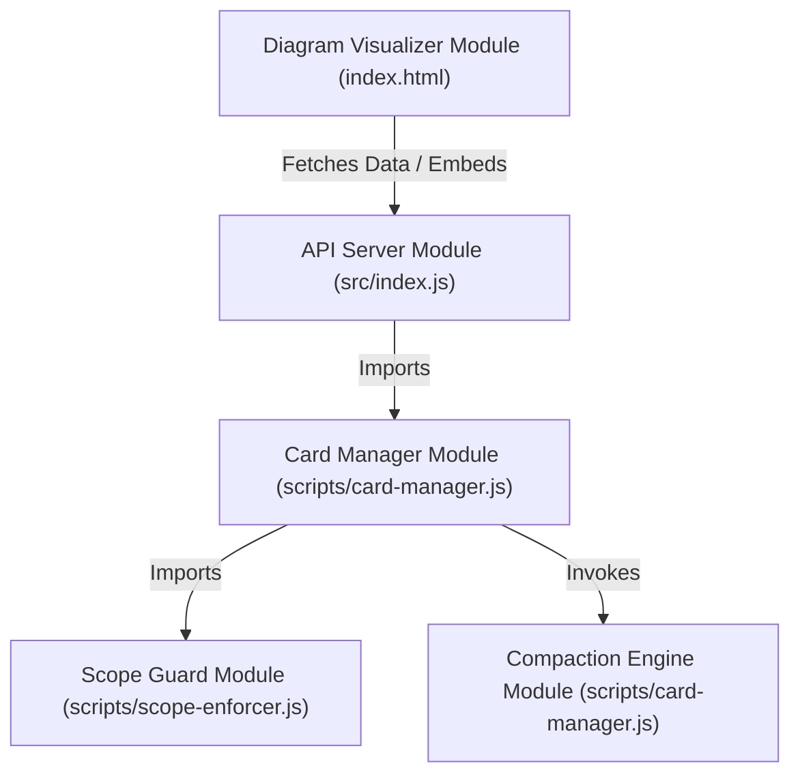

# 4. Module Diagram Documentation

---

## 🧩 4.1 Module Relationship Diagram

---

## 📋 4.2 Module Specification Table

### 1. Card Manager Module
- **Responsibility**: Khởi tạo thẻ mới từ prompt, chuyển thẻ cũ sang DONE, tư vấn bộ công cụ đa dạng và kiểm tra trạng thái Cạn Scope.
- **Dependency**: `scripts/scope-enforcer.js`, `data/cards.json`.
- **Public API**: `processUserPrompt()`, `checkIdleScopeState()`, `adviseToolsFromPrompt()`.

### 2. Scope Guard Module
- **Responsibility**: Định nghĩa bảng quy tắc ranh giới Scope (`SCOPE_DIAGRAM`, `SCOPE_CORE_ENGINE`, `SCOPE_SECURITY`, `SCOPE_PAYMENT`, `GLOBAL_SCOPE`) và kiểm tra tính hợp lệ khi sửa file.
- **Dependency**: Native Node.js `path` module.
- **Public API**: `ScopeEnforcer.validateAction(scopeName, targetFilePath)`.

### 3. Compaction Engine Module
- **Responsibility**: Tự động gom nén 10 Thẻ Lẻ hoàn thành thành 1 File Milestone (`MILESTONE-xxx.json`) và nén 10 Milestones thành 1 Báo cáo Macro (`MASTER_REPORT-xxx.md`).
- **Dependency**: Native Node.js `fs` & `path` modules.
- **Public API**: `compactCardsIfNeeded()`, `compactMilestonesIfNeeded()`.

### 4. API Server Module
- **Responsibility**: Phục vụ static file `index.html` và cung cấp các REST API Endpoints `/api/health`, `/api/skills`, `/api/cards`.
- **Dependency**: `http`, `fs`, `path`, `url`, `scripts/card-manager.js`.
- **Public API**: HTTP Server Port 3000.
