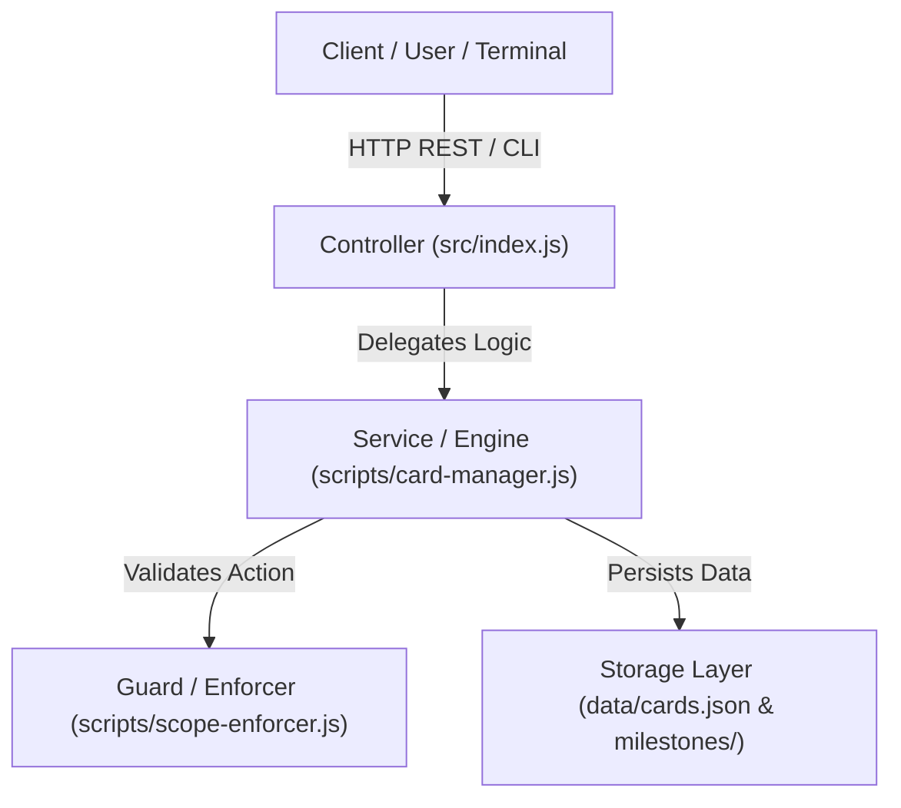

# 2. Package Diagram Documentation

Dựa trên phân tích codebase hiện tại, hệ thống sử dụng cấu trúc **Native Lightweight Controller-Service-Storage Architecture** không dùng framework nặng.

---

## 📦 2.1 Package Architecture Flow

---

## 🔍 2.2 Chi Tiết Các Tầng (Layers)

| Tầng (Layer) | File đại diện | Vai trò kỹ thuật |
| :--- | :--- | :--- |
| **Controller Layer** | `src/index.js` | Tiếp nhận HTTP Request (`GET /api/cards`, `POST /api/cards`, `GET /api/health`), định tuyến MIME types và phản hồi JSON. |
| **Service Layer** | `scripts/card-manager.js` | Xử lý logic tạo thẻ từ prompt, nén thẻ phân cấp 10-in-1, tự động phát hiện Cạn Scope (IDLE) và tư vấn bộ công cụ đa dạng. |
| **Guard / Boundary Layer** | `scripts/scope-enforcer.js` | Kiểm tra ranh giới file path tương ứng với Scope được giao (`SCOPE_DIAGRAM`, `SCOPE_CORE_ENGINE`, etc.). |
| **Storage Layer** | `data/cards.json` `data/milestones/` `data/reports/` | Nơi lưu trữ bền vững phẳng dạng JSON & Markdown. |
