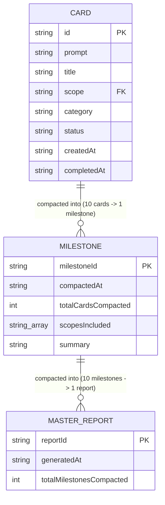

# 7. Database Documentation

**Database Status:** File-Based JSON & Markdown Multi-Tier Persistence Storage (PostgreSQL/SQL Database was explicitly removed per user decision to keep the skill 100% lightweight).

---

## 🗄 7.1 Data Storage ERD Diagram (JSON Schema Entities)

---

## 📋 7.2 Storage File Schemas

### 1. Active Cards File (`data/cards.json`)
- **Type**: Array of Card Objects (Level 0 Persistence).
- **Max Capacity**: 10 Active Cards (Compaction Engine automatically purges completed cards when count >= 10).
- **Field Definitions**:
  - `id` (String, Unique PK): E.g., `"CARD-001"`.
  - `prompt` (String): Raw user input from Gemini/Terminal.
  - `title` (String): Generated task summary title.
  - `scope` (String): Assigned Scope Boundary (`SCOPE_DIAGRAM`, `SCOPE_CORE_ENGINE`, etc.).
  - `category` (String): Task category.
  - `status` (String): Status Enum (`"IN_PROGRESS"`, `"DONE"`, `"WAITING_USER_APPROVAL"`, `"PROPOSED_BY_AI"`).
  - `createdAt` (String): ISO 8601 Timestamp.
  - `completedAt` (String, Optional): ISO 8601 Timestamp when finished.

### 2. Milestone Files (`data/milestones/MILESTONE-xxx.json`)
- **Type**: Single JSON Document per 10 Completed Cards (Level 1 Persistence).
- **Fields**:
  - `milestoneId`: E.g., `"MILESTONE-001"`.
  - `compactedAt`: ISO 8601 Timestamp.
  - `totalCardsCompacted`: Integer (10).
  - `scopesIncluded`: Array of Strings (Unique scopes in this batch).
  - `cards`: Array of 10 complete Card objects.

### 3. Executive Macro Reports (`data/reports/MASTER_EXECUTIVE_REPORT_xxx.md`)
- **Type**: Markdown Document per 10 Milestones / 100 Cards (Level 2 Persistence).
