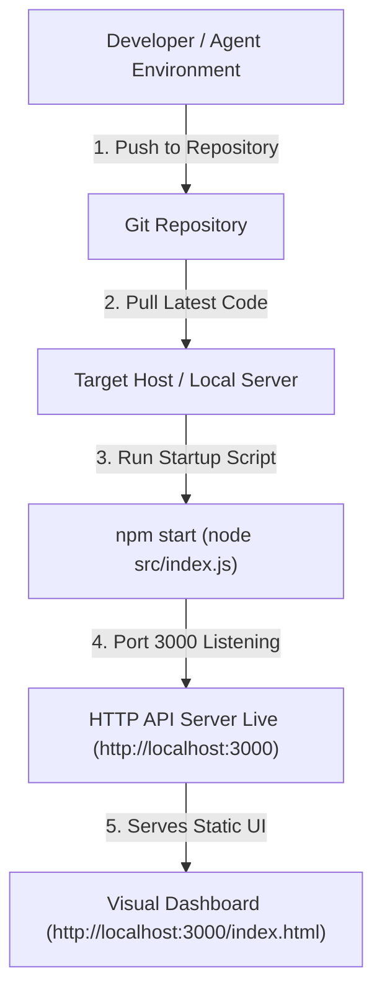

# 12. Deployment Documentation

**Deployment Status:** Native Node.js Zero-Dependency Deployment (Docker & SQL were explicitly removed per user decision to ensure 100% lightweight skill execution).

---

## 🚀 12.1 Native Node.js Deployment Flow

---

## 📦 12.2 Deployment Checklist

- [x] Node.js >= v18 installed on host.
- [x] Dependencies installed (`npm install`).
- [x] Data directories exist (`data/`, `data/milestones/`, `data/reports/`).
- [x] HTTP Server port 3000 open.
- [ ] *Docker Containerization*: **Not Implemented** (Removed per user decision).
