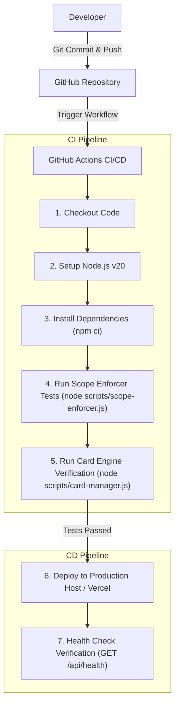

# 14. CI/CD Pipeline Documentation

**CI/CD Status:** Local Direct Execution & Verification Mode (Automated CI/CD Actions Pipeline is *Not Implemented*, proposed blueprint below).

---

## 🔄 14.1 Proposed CI/CD Pipeline Diagram

