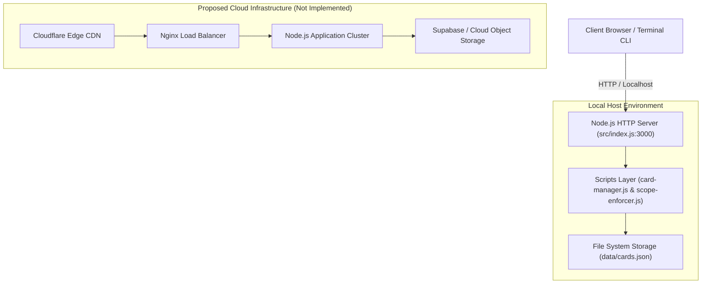

# 13. Infrastructure Documentation

---

## 🌐 13.1 Infrastructure Topology Diagram

```mermaid
graph TD
    Client["Client Browser / Terminal CLI"] -->|HTTP / Localhost| NodeServer["Node.js HTTP Server (src/index.js:3000)"]
    
    subgraph Host_Environment ["Local Host Environment"]
        NodeServer --> Engine["Scripts Layer (card-manager.js & scope-enforcer.js)"]
        Engine --> LocalStorage["File System Storage (data/cards.json)"]
    end

    subgraph Proposed_Cloud_Infrastructure ["Proposed Cloud Infrastructure (Not Implemented)"]
        Cloudflare["Cloudflare Edge CDN"] --> LoadBalancer["Nginx Load Balancer"]
        LoadBalancer --> AppCluster["Node.js Application Cluster"]
        AppCluster --> CloudStorage["Supabase / Cloud Object Storage"]
    end
```
