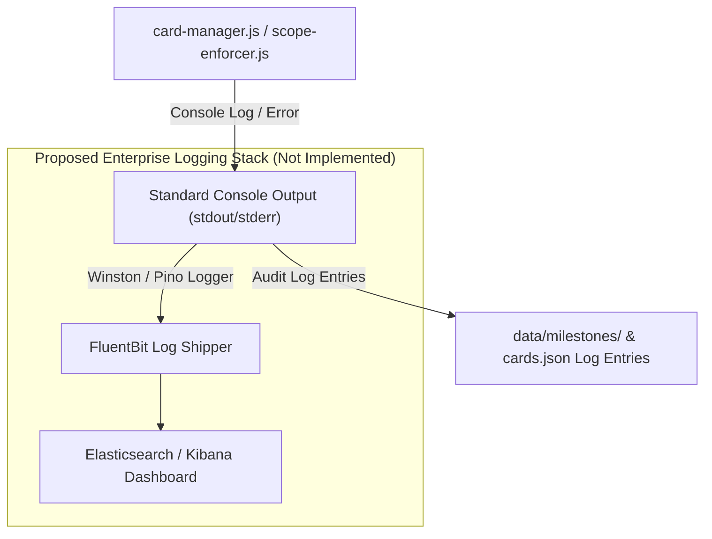

# 15. Logging Architecture Documentation

---

## 🪵 15.1 Logging Architecture Diagram

---

## 📋 15.2 Current Log Event Types

1. `[COMPACTION ENGINE] ⚡ Đã nén 10 Thẻ Lẻ thành Milestone File: MILESTONE-xxx.json`
2. `[BẢO VỆ SCOPE] Hành động bị CHẶN! Thẻ hiện tại có scope là [SCOPE_X], không được phép sửa file [FILE_Y].`
3. `[AGY Server] Listening on http://localhost:3000`
