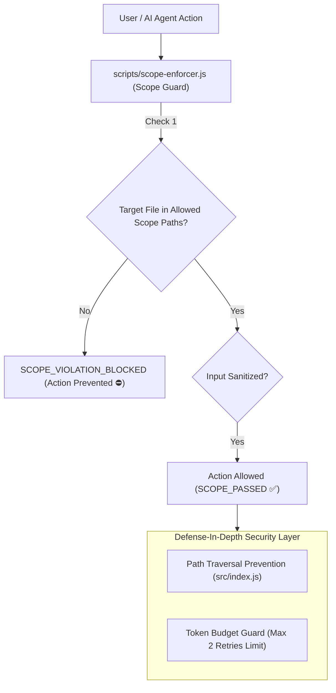

# 17. Security Architecture Documentation

---

## 🛡 17.1 Security Enforcement Architecture Diagram

---

## 📋 17.2 Security Implementation Checklist

| Category | Status in Codebase | Implementation Details |
| :--- | :--- | :--- |
| **Scope Boundary Guard** | **IMPLEMENTED** | `scripts/scope-enforcer.js` blocks unauthorized file edits outside active card scope (`SCOPE_DIAGRAM`, `SCOPE_CORE_ENGINE`, etc.). |
| **Directory Traversal Defense** | **IMPLEMENTED** | `src/index.js` verifies `filePath.startsWith(PUBLIC_DIR)` before serving static files. |
| **Token Budget Protection** | **IMPLEMENTED** | `scripts/card-manager.js` limits max 2 retries per bug to prevent token exhaustion loops. |
| **CORS Restriction** | **IMPLEMENTED** | Headers set in `src/index.js`. |
| **OAuth / JWT / Password Hashing** | *Not Implemented* | Proposed in `docs/api/authentication-flow.md` for production deployment. |
