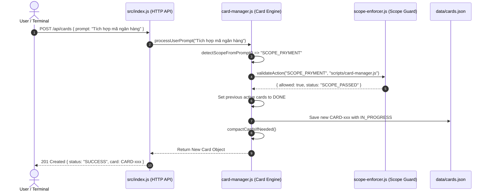

# 9. Sequence Diagram - Card Creation Workflow

---

## 🔄 9.1 Sequence Diagram: Create Task Card from User Prompt

```mermaid
sequenceDiagram
    autonumber
    actor User as User / Terminal
    participant Server as src/index.js (HTTP API)
    participant Engine as card-manager.js (Card Engine)
    participant Guard as scope-enforcer.js (Scope Guard)
    participant Storage as data/cards.json

    User->>Server: POST /api/cards { prompt: "Tích hợp mã ngân hàng" }
    Server->>Engine: processUserPrompt("Tích hợp mã ngân hàng")
    Engine->>Engine: detectScopeFromPrompt() => "SCOPE_PAYMENT"
    Engine->>Guard: validateAction("SCOPE_PAYMENT", "scripts/card-manager.js")
    Guard-->>Engine: { allowed: true, status: "SCOPE_PASSED" }
    Engine->>Engine: Set previous active cards to DONE
    Engine->>Storage: Save new CARD-xxx with IN_PROGRESS
    Engine->>Engine: compactCardsIfNeeded()
    Engine-->>Server: Return New Card Object
    Server-->>User: 201 Created { status: "SUCCESS", card: CARD-xxx }
```
