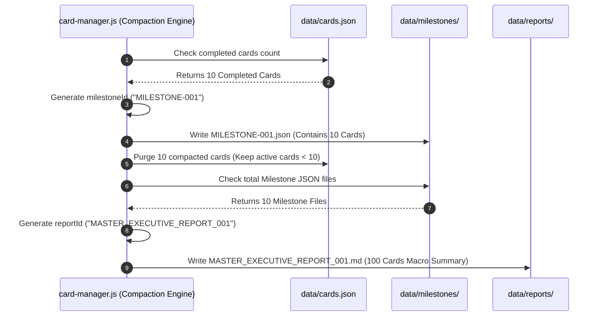

# 9. Sequence Diagram - Hierarchical Compaction Workflow

---

## 🗂 9.2 Sequence Diagram: 10-to-1 Hierarchical Card Compaction

```mermaid
sequenceDiagram
    autonumber
    participant Engine as card-manager.js (Compaction Engine)
    participant CardsFile as data/cards.json
    participant MilestoneDir as data/milestones/
    participant ReportDir as data/reports/

    Engine->>CardsFile: Check completed cards count
    CardsFile-->>Engine: Returns 10 Completed Cards
    Engine->>Engine: Generate milestoneId ("MILESTONE-001")
    Engine->>MilestoneDir: Write MILESTONE-001.json (Contains 10 Cards)
    Engine->>CardsFile: Purge 10 compacted cards (Keep active cards < 10)
    
    Engine->>MilestoneDir: Check total Milestone JSON files
    MilestoneDir-->>Engine: Returns 10 Milestone Files
    Engine->>Engine: Generate reportId ("MASTER_EXECUTIVE_REPORT_001")
    Engine->>ReportDir: Write MASTER_EXECUTIVE_REPORT_001.md (100 Cards Macro Summary)
```
