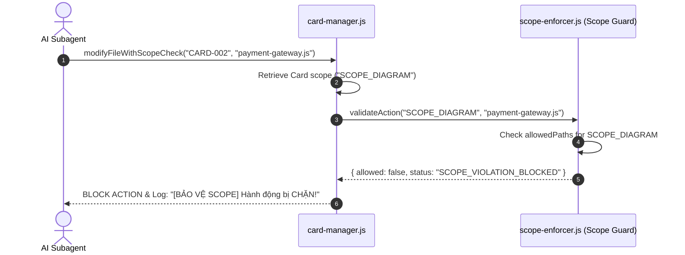

# 9. Sequence Diagram - Scope Validation Workflow

---

## 🛡 9.3 Sequence Diagram: Scope Boundary Check & Action Violation Blocker

```mermaid
sequenceDiagram
    autonumber
    actor Subagent as AI Subagent
    participant Engine as card-manager.js
    participant Guard as scope-enforcer.js (Scope Guard)

    Subagent->>Engine: modifyFileWithScopeCheck("CARD-002", "payment-gateway.js")
    Engine->>Engine: Retrieve Card scope ("SCOPE_DIAGRAM")
    Engine->>Guard: validateAction("SCOPE_DIAGRAM", "payment-gateway.js")
    Guard->>Guard: Check allowedPaths for SCOPE_DIAGRAM
    Guard-->>Engine: { allowed: false, status: "SCOPE_VIOLATION_BLOCKED" }
    Engine-->>Subagent: BLOCK ACTION & Log: "[BẢO VỆ SCOPE] Hành động bị CHẶN!"
```
